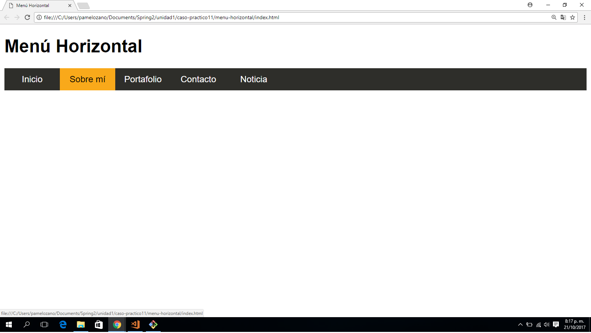

# MENÚ HORIZONTAL
Este repositorio contiene un proyecto de (Maquetación de una barra de navegacion horizontal).

### Pondremos en práctica lo siguiente:
1. Aplicaremos **selectores:**
    * Selector elemento: (body, nav, ul, li, a)
    * Pseudo selectores: (hover)

2. Aplicaremos __"elementos que componen el modelo de caja"__
    * Padding **(relleno)**.
    * Margin **(margen)**

3. Aplicaremos la __"propiedad de los elementos de caja"__
    * Float **(por bloques)**
    * background-color **(Color al bloque)**
    * color **(color de texto)**
    * width **(Ancho de la caja)**
    * height **(Alto de la caja)**
    * list-style **(indica estilo de la lista)**
    * line-height **(especifica la altura de la caja tipo en línea (inline))**

4. Aplicaremos __"Estados de enlaces"__ pseudo-clase:
    * Hover **(cuando el usuario se desplaza sobre ella)**

## Herramientas Utilizadas:
1. HTML5
2. CSS3

## Objetivo final:
    * Imagen final del menú horizontal:

